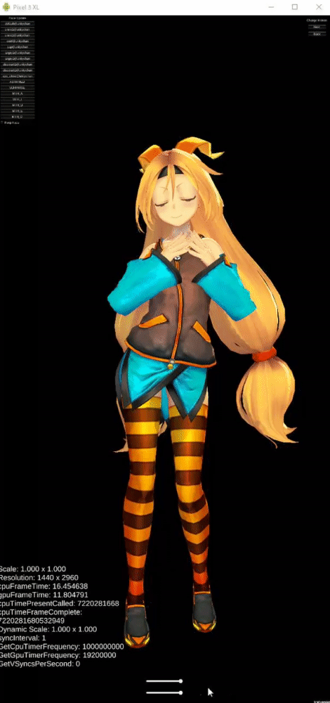

# SimpleSampleDynamicResolution
## 概要
動的に画面解像度を変更するシンプルなサンプルです。
解像度を落とすことでgpuFrameTimeが現象することが確認出来ます。

## 動作環境
Unity2019.3.6で作成しましたが、Unity2018.4以降でも動作する筈です。
`ScalableBufferManager` を使用して解像度を変更している為、サポートしているプラットフォーム（グラフィックドライバ）は下記の通りです。
UnityEditor上では動作しませんのでご注意下さい。
- Xbox One
- PS4
- Nintendo Switch
- iOS/tvOS (Metal のみ)
- Android (Vulkan のみ)
### 注意事項
Unity2019.3のマニュアルではWindows Standaolneでもサポートしているという記述がありますが、調査した所下記の制限がありますのでご注意下さい。
- Graphic API には`DirectX 12`を指定する必要がある。
- 起動時オプションに`-force-d3d12-stablepowerstate`を追加する必要がある。
- FrameTimingManagerには未対応。(2020.1以降で対応予定ではあるが2020.1.0b5の時点では未完成)

## 補足
Player 設定 (Edit> Project Settings から Player カテゴリを選択) を開き、Enable Frame Timing Stats チェックボックスをチェックを入れた上で、CameraのallowDynamicResolution及びRenderTextureのuseDynamicScaleがtrueのものが対象です。
ScalableBufferManager.ResizeBuffers()を実行するだけで上記でチェックを入れたオブジェクトにスケールが掛かります。
詳しくは下記のドキュメントを参考にして下さい。
参考URL
https://docs.unity3d.com/ja/2018.4/Manual/DynamicResolution.html
